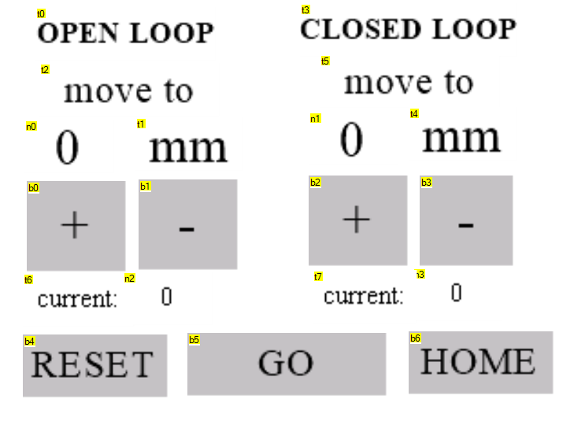
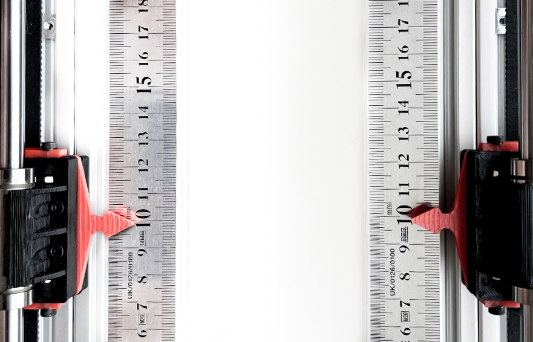
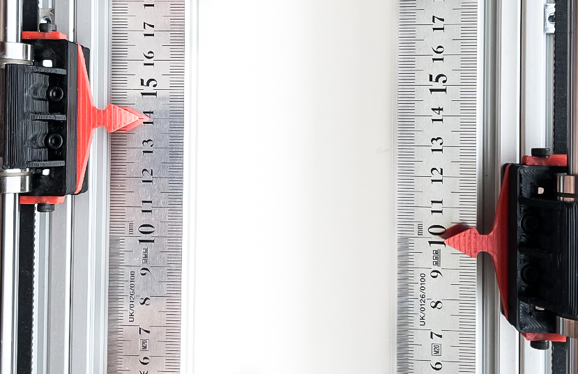
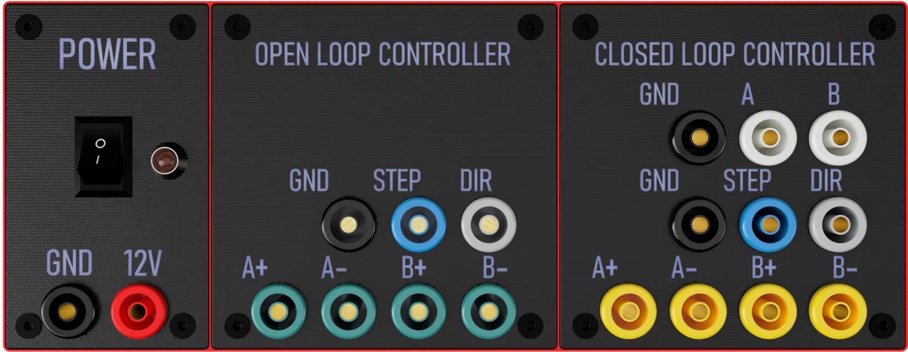

# TODO: Nosaukums

---

## 📝 Saturs

+ [Par iekārtu](#par)
+ [Darbības principi](#working)
+ [Lietošana](#usage)
+ [Mērījumu veikšana](#measurements)
+ [Autori](#authors)

## Par iekārtu 

Atvērtā un slēgta cikla vadības risinājuma demonstrēšanas iekārta radīta ar mērķi iepazīstināt studentus ar šīm divām dzinēju vadības metodēm.

Iekārta un tās dokumentācija veidota tā, lai ne tikai vizuāli un vienkāršoti demonstrētu gan atvērtu, gan slēgta cikla vadību, bet arī sniegtu iespēju veikt praktiskus eksperimentus.

 

## Darbības principi 

---

Iekārtas mehānisma galvenā funkcija ir pārvietot indikatoru uz noteiktu pozīciju, ko ievada lietotājs.  Uz iekārtas atrodas divi indikatori, viens tiek vadīts ar atvērta tipa vadību, bet otrs ar slēgta cikla vadību. Abu indikatoru kustību nodrošina identiski soļudzinēji, viens no šiem soļudzinējiem aprīkots ar optisku enkoderi, kas tiek pielietots vadības cikla noslēgšanai jeb dzinēja rotācijas kustības reģistrēšanai.

### Mehāniskā uzbūve

Iekārtas korpuss veidots no ekstrudētiem alumīnija profiliem, kas savstarpēji savienoti gan ar industriāli lietotiem savienojumiem, gan 3D drukātām detaļām. Ar 3D drukas tehnoloģijas palīdzību izgatavotas detaļas soļudzinēju stiprināšanai un piedziņas siksnu spriegošanai. Arī Indikatori izgatavoti ar 3D drukas tehnoloģiju, tajos nostiprināti lineārie gultņi, kas atvieglo kustību, kas notiek pa kalibrēta izmēra vadīklām.

### Lietotāja saskarne

Iekārtas lietošana demonstrēšanas režīmā notiek caur nelielu skārienjūtīgo ekrānu, kas atrodas pie iekārtas.

Izmantojot ➕ un ➖ pogas iespējams iestatīt pozīciju uz kuru lietotājs vēlas pārvietot indikatoru.

Ekrāna apakšā atrodas trīs pogas:

+ RESET atiestatīt šī brīža iestatīto pozīciju;
+ HOME doties uz iekārtas darba sākuma pozīciju izmantojot gala slēdžus;
+ GO doties uz pozīciju, kas iestatīta uz ekrāna.

## Lietošana 

---

Lai lietotu iekārtu, nepieciešams pievienot strāvas avotu tam paredzētajām pieslēgvietām iekārtas paneļa POWER sadaļā.  

> ⚠️ Iekārtai paredzēts **12V** strāvas avots, tā **nav aprīkota** ar pārsprieguma un pretēja sprieguma aizsardzību

Pievienojot strāvas avotu un ieslēdzot galveno slēdzi, POWER sadaļā jāiedegas gaismas diodei, kas norāda, ka iekārta saņem strāvu. Tāpat iekārtas skārienjūtīgajam ekrānam būtu jāieslēdzas un jāparāda iespriekš aprakstītajam lietotāja saskarnes ekrānam.

Uzsākot darbu ar iekāru nepieciešams izmantot HOME funkciju, lai iekārta zinātu indikatoru atrašanās vietu.

Izmantojot ➕ un ➖ pogas uz displeja nepieciešamas iestatīt pozīciju uz kuru doties indikatoram. Pirmajam eksperimentam iesakām izmantot vienu un to pašu pozīciju gan atvērtā, gan noslēgtā cikla vadības indikatoram, piemēram, 98 mm.

Izmantojot HOME pogu iespējams atkārtoti iestatīt iekārtu sākuma pozīcijā. Tāpat kā iepriekš iestata izvēlētu pozīciju un ar pogu GO uzsāk kustību. Ar roku pieturot indikatorus neļauj tiem izkustēties, atvērtā tipa vadības indikators pēc atlaišanas paliek nekustīgs, bet slēgtā cikla vadības indikators nostājas iestatītajā vietā pēc tā atlaišanas.
Attēlā redzams kā slogotais (atvērtās vadības) indikators apstājies pozīcijā, kas atšķiras no iestatītas. 

Ja pēc šī eksperimenta veikšanas netiks izmantota HOME funkcija, atvērtās vadības indikatoram nav iespējams zināt reālo pozīciju.

## Mērījumu veikšana 

---

Izmantojot iekārtas panelī pieejamās pieslēgvietas, iespējams veikt mērījumus un novērojumus.

POWER sadaļā, kā jau iepriekš aprakstīts, pieslēdzams strāvas avots.

OPEN LOOP CONTROLLER un CLOSED LOOP CONTROLLER sadaļās atrodamas pēc funkcijas vienādas pieslēgvietas. Katrā no sadaļām atrodamās pieslēgvietas atbilst attiecīgajam dzinējam.

|Apzīmējums | Nosaukums | Apraksts|
|------|-----|-----|
|A +|Dzinēja A spoles I izvads| Iespējams veikt novērojumus spriegumam uz dzinēja A spoles|
|A -|Dzinēja A spoles II izvads| Iespējams veikt novērojumus spriegumam uz dzinēja A spoles|
|B +|Dzinēja B spoles I izvads| Iespējams veikt novērojumus spriegumam uz dzinēja B spoles|
|B -|Dzinēja B spoles II izvads| Iespējams veikt novērojumus spriegumam uz dzinēja B spoles|
|GND||Savienots ar strāvas avota negatīvo spraudni, izmantojams kā atskaites punkts |
|STEP||Motoru vadības draivera kontroles signāls. Pulsveida signāls, kura katrs pulss nosaka viena soļa (vai mikrosoļa) veikšanu dzinējam|
|DIR||Motoru vadības draivera kontroles signāls, kas nosaka motora griešanās virzienu

TODO: add typical STEP DIR pattern.

CLOSED LOOP CONTROLLER sadaļā pieejamas papildus divas pieslēgvietas
|Apzīmējums | Nosaukums | Apraksts|
|------|-----|-----|
|A|Optiskā enkodera A fāze| Viens no enkodera signāliem ar kura palīdzību var sekot līdzi dzinēja vārpstas rotācijai|
|B|Optiskā enkodera B fāze| Viens no enkodera signāliem ar kura palīdzību var sekot līdzi dzinēja vārpstas rotācijai|

TODO: add typical encoder signal diagram.

## ✍️ Autori 

+ [@JenertsA](https://github.com/JenertsA) - Programmnodrošinājums un dokumentācija
+ [@esprudzs](https://github.com/esprudzs) - 3D druka un mehānika
